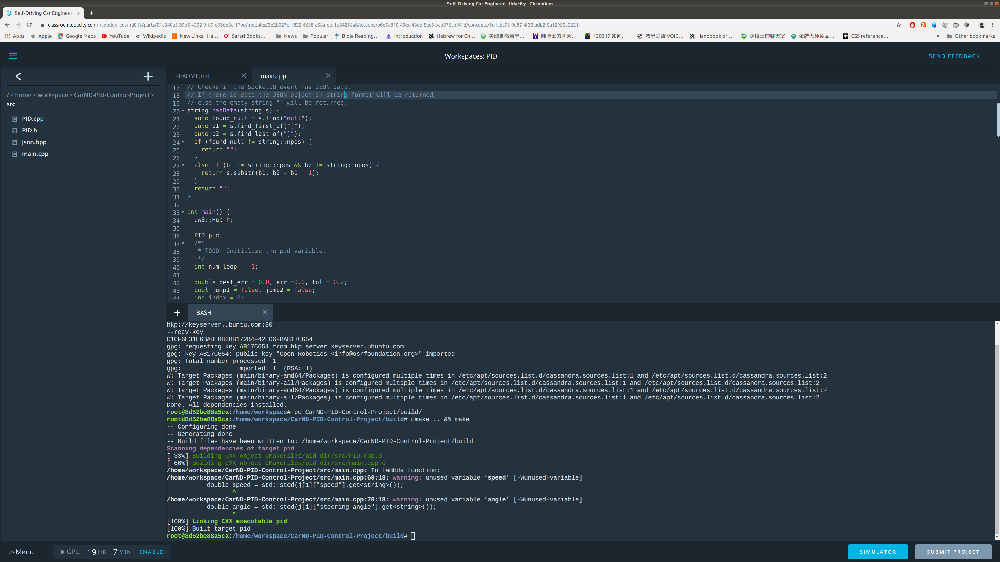

# CarND-PID-Controller-Project
Self-Driving Car Engineer Nanodegree Program

Overview
---
This project uses Proportional, Integral, and Differential (PID) controller to assist a simulated autonomous vehicle around racetrack.   

### Rubrics
The rubrics of this project are the following:
1. Code compiles without errors.
2. The PID procedure follows what was taught in the lessons.
3. Describe the effect each of the PID components had in your implementation.
4. Describe how the final hyperparameters were chosen.
5. The vehicle must successfully drive a lap around the track.0

### Rubric #1: Code compiles without errors.

Code compiles correctly as shown in picture below

### Rubric #2

The Cross Track Error (CTE) is provided from the simulator and is equivalent to the proportional error, see line 38 in PID.cpp. The differential error is the difference between the previous CTE and current CTE, line 37 in PID.cpp. The integral error is accumulated CTE over time and is coded in line 39 in PID.cpp. The total error is calculated using the TotalError method in PID.cpp, line 47.

### Rubric #3 and #4

The proportional error tries to counter the CTE therefore steering the car to the centerline of the track. It typically overshoots the centerline and re-corrects back to the centerline. Shown in this video. [Proportional Error Video](proportionalError.mp4)

The differential error counter-steers the car when the CTE over time gets very small. Shown in this video. [Differential Error Video](DifferentialError.mp4)

The integral error tries to counter the bias that the car accumulates over a period of time. [Integral Error Video](IntegralError.mp4)

The twiddle algorithm was used initially to find the hyperparameters. Lines 79 to 140 in main.cpp. However, CTE updated in real time and the car runs off the track when the hyperparameters are not given a change to be optimized. Therefore, I resorted to tuning the parameters manually by basing it on observing how the car behavior with each parameters.

###Rubric #5

Car drives around the track meeting all safety requirements. [Around the track Video](AroundTheTrack.mp4)
